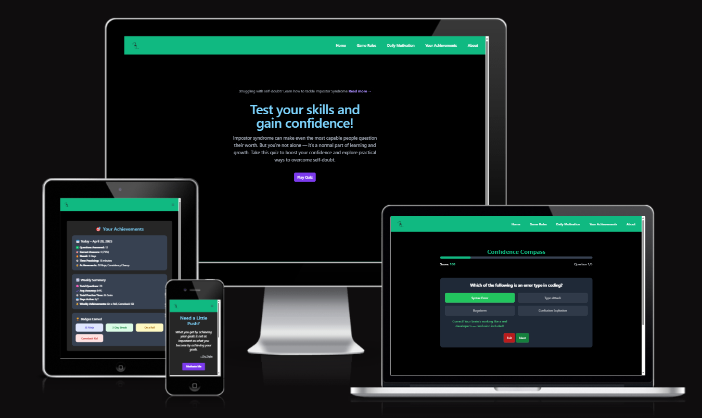
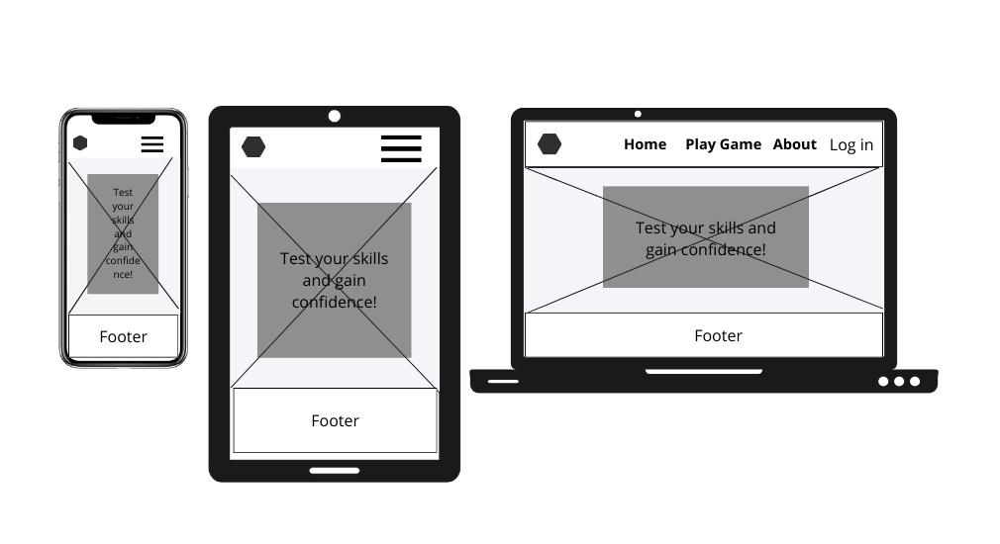
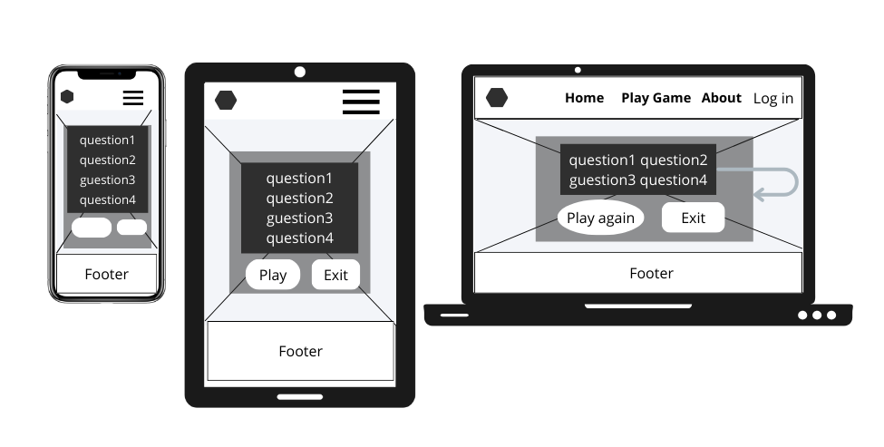
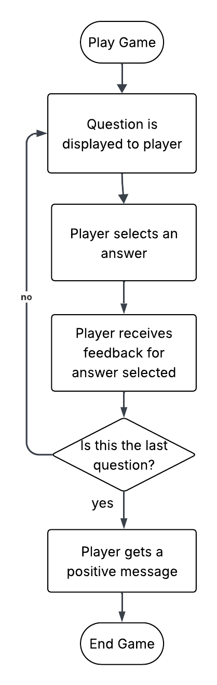

# Confidence Compass

View the Live Project [here](https://alexiou981.github.io/team2-imposter-quiz/)

# Table of Content
- [User Expeience](#user-experience)
    - [Project Goals](#project-goals)
    - [User Stories](#user-stories)
    - [Design Choices](#design-choices)
    - [Wireframes](#wireframes)
- [Game Logic](#game-logic)    
- [Features](#features)
- [Technologies Used](#technologies-used)
- [Code](#code)
- [Testing](#testing)
    - [Bugs](#bugs)
    - [Unresolved Bugs](#unresolved-bugs)
    - [Tesing User Stories](#testing-user-stories)
    - [Manual Testing](#manual-testing)
    - [Automated Testing](#automated-testing)
    - [Accessibility](#accessibility)
- [Deployment](#deployment)
- [Maintenance & Updates](#maintenance--updates)
- [Credits](#credits)

## User Experience

### Project Goals

The aim of this app is to create a quiz game designed to challenge the negative thoughts associated with imposter syndrome — a feeling that is particularly common among people working in the IT field, where the fast-changing environment makes it impossible to know everything at once.
This game was created to help learners and professionals alike recognise that self-doubt is normal, and mistakes are part of the learning process — not a sign of failure.
The game is intended for coders at all stages of their learning journey. The questions are designed with a beginner-friendly approach, offering imposter-syndrome-busting coding questions in a multiple-choice format. 

### User Stories

- As a user I want to have access to a home page so that I can find out general info about the quiz.
- As a user I want to have easy access to the game's instructions so that I can understand how to play.
- As a new learner of coding, I often feel like I’m not smart enough and doubt whether I’ve chosen the right career path, especially when I struggle to understand the code. I would like a relaxing game that shows me it’s normal to have these thoughts while learning something new.
- As a user I want to be able to play the game seamlessly so that I can have a pleasant experience when the imposter syndrome takes over me.
- As a coder, I want a game that will help beat my imposter syndrome on my mobile phone, when I need a break, so I can crack on with my work.
- As an experienced coder who knows that I know nothing, I want a place to chill out, so I can relax and come back to work refreshed.
- As a person who sometimes doubts themselves, I would like a quiz game which is challenging, but not too much, so when I resolve some task or question, I feel better.
- As a remote worker who often feels isolated, I want a game that reminds me I’m part of a global community of learners, so I don’t feel alone in my struggles.

The project's Kanban Board can be viewd [here](https://github.com/users/Alexiou981/projects/11)

### Design Choices

#### Fonts

#### Icons

#### Images

The image was chosen as the logo because it perfectly represents the concept of imposter syndrome. The tangled scribble inside the head visually conveys the confusion and self-critical thoughts often experienced in this state of mind. The hand gently pulling on the thread symbolises the process of unravelling these thoughts, highlighting the journey of overcoming imposter syndrome. The logo has been designed in both white and black styles, with a transparent background. This allows the appropriate version to be selected based on the background colour of the website.

### Wireframes

#### Home wireframe

The Home page wireframe was created as the base design, and all other pages maintain a consistent layout and visual style.

#### Game wireframe

## Game Logic

How to play:
        <ol>
            <li>Click on the "Start" button.</li>
            <li>Reply to the question.</li>
            <li>You will receive immediate feedback.</li>
            <li>Reply to the next question - there will only be five of them.</li>
            <li>Bask in the immediate gratification of the relaxing atmosphere and the guilt-free pat on your back.</li>
        </ol>

## Features

All pages share the same navigation bar, which includes a logo and six links leading to different sections of the website. On smaller devices, the navigation collapses into a burger menu for better usability.

The website consists of six pages, accessible via both the navigation bar and the footer: Home, About, Game Rules, Daily Motivation, and Your Achievements.
The Game page is only accessible via the Play Quiz button on the Home page, and the 404 Page is not directly accessible.

Every page uses a consistent colour scheme and layout to ensure a unified look and feel.

🌐 Home Page

The landing page features:

- A link at the top directing users to an external article on Psychology Today about tackling impostor syndrome.

- A large heading and a short paragraph encouraging users to take part in the quiz.

- A Play Quiz button which leads directly to the Game page.

🎮 Game Page

- The player is presented with four questions, which can be answered by clicking or tapping (on mobile).

- An Exit button allows the player to leave the quiz at any moment.

- This is the only page without a footer, to maximise space for gameplay on smaller screens.

👥 About Page

- Displays photos of the team members who took part in the hackathon, each with a short description.

- Includes a paragraph explaining why this particular theme was chosen for the project.

💡 Daily Motivation Page

- Features a collection of motivational quotes to inspire and uplift users.

🏆 Your Achievements Page

- Displays the player’s achievements for the current day.

- Below that, shows the player’s achievements accumulated over the week.

🔗 Footer

- The footer is identical across all pages and contains the website name, social media links (which open in a new tab), and a repeat of the navigation links for easy access.

## Technologies Used

- HTML, Tailwind CSS and JavaScript were used as the languages.

## Code

## Testing

### Bugs
- Non applicable

### Unresolved Bugs
- Non applicable

### Manual Testing
#### Tested navbar functionality
##### Expected Outcome: 
- User must be able to easily navigate through the page using the navbar - all links must be functional.

##### Testing: 
- Navigate on the deployed site, try accessing all available pages on tha navbar by clicking on each page, returning back to home and then clickin on the next to test that all links work for index.html.
- Follow the same process for each html file to ensure that links are working in all available pages.

##### Result:
- User gets successfully redirected to the appropriate pages - test works ✅

#### Tested navbar on smaller screens
##### Expected Outcome:
- The navbar should be hidden in a dropdown on smaller screen sizes, the pages shoud be displayed in a columb inside the dropdown box and direct user to each page available.

##### Testing: 
- Either go on a mobile device or using Chrome's Inspect tool, access the site in tablet or mobile screen size and click on the burger icon, then choose one of the available pages, once redirected to the appropriate page open the dropdown and try another page until all pages have been tested.

##### Result:
- user gets successfully redirected to the appropriate pages - test works ✅

#### Tested game functionality
##### Expected Outcome:
- Upon landing on the Game page the user get's prompted to reply to a question using four possible option, once they have selected an answer they should receive immediate feedback and the option to move onto the next question. Once the player has reached question 5 they should have an option to exit or restart the game.

##### Testing: 
- Player starts the game by choosing an answer, clicking on the Next button and proceeding till the end of the game.

##### Result:
- Users gets displayed with the first question and the game begins, once an answer is picked there is immediate feeback displayed and a little text encouraging the user -  works as expected ✅

#### Tested daily motivation functionality
##### Expected Outcome:
- The user arrives on the Daily Motivation page and clicks on the Motivate me button, a motivational quote is displayed, if they need more they click the button again and it refreshes with a new quote.

##### Testing:
- Player arrives on the page and click on Motivate Me button.

##### Result:
- Motivational quotes are being displayed successfully - works as expected ✅

## Deployment

The website was deployed using GitHub Pages, which provides a simple way to host static websites directly from a GitHub repository. Below are the steps taken to deploy the project:

1. Repository Setup
- The project files were uploaded to a GitHub repository.
- The main branch was used for deployment.

2. Enabling GitHub Pages
- In the repository settings, GitHub Pages was enabled.
- The source branch was set to main.
- The deployment was configured to serve files from the root directory.
3. Accessing the Live Website
- Once the deployment process was completed, the website became accessible at the provided GitHub Pages URL.
- The link to the deployed site: https://alexiou981.github.io/team2-imposter-quiz/

4. Updating the Website
- Any changes pushed to the main branch automatically update the live website.
- Regular updates are made using Git commits and pushes.

## Maintenance & Updates

## Credits

### Tools

- [Pixabay](https://pixabay.com/) to downland the images for the logo and the background.
- [Favicon](https://favicon.io/) to create favicon.
- [CSS Validator](https://jigsaw.w3.org/css-validator/) to test style.css
- [HTML Validator](https://validator.w3.org/) Markup Validation Service
- Lighthouse Chrome Dev Tools for testing.
- [GitHub](https://github.com/) to store the project and project board.
- [Open AI](https://openai.com/chatgpt/overview/) to create questions.
- [Firefly] ()
- [Photopea](https://www.photopea.com/) to create the logo.
- [Birme](https://www.birme.net/) to resize images.
- [Canva](https://www.canva.com/) to design wireframes.
- [Am I responsive](https://ui.dev/amiresponsive) to create responsive mockups.

### Content

The quiz questions were created using [ChatGPT (OpenAI)](https://openai.com/chatgpt/overview/). The content was reviewed for spelling, grammar and consistency, and enhanced with the help of ChatGPT. Some sections were also translated and refined to improve readability.

### Media

Illustration by BiancaVanDijk — sourced from [Pixabay](https://pixabay.com/illustrations/to-think-to-care-depression-only-9440584/) — slightly modified.

Image for the background - [Pixabay](https://pixabay.com/photos/mask-ceramic-performing-arts-208942/)
